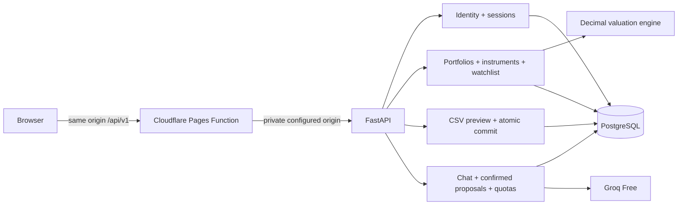

# Architecture and financial rules

Lokifi v2 is one statically exported Next.js application on Cloudflare Pages, one modular FastAPI application on Render, and PostgreSQL on Neon. The active runtime is `apps/web` and `apps/api`. Groq provides optional hosted inference. There is no Redis, market-data worker, public webhook processor, or separate admin app. A narrow on-demand Coinbase Exchange adapter resolves supported EUR crypto products and reference prices; it never fabricates a fallback.

Frontend features are separated into portfolio overview, holding details/editing, imports, instrument identity, watchlist and account settings. Shared components implement accessible fields, modal focus, valuation status and branding. `App.tsx` coordinates session and route state. It does not store financial records in localStorage. The route allowlist returns 404 for legacy features.

## Contract and persistence

FastAPI's OpenAPI document is the contract. `npm run contracts` regenerates the frontend declaration file; `node tools/contracts.mjs --check` fails on drift. UUID strings identify records. Unknown or another user's IDs return 404. Input schemas reject extra fields; users cannot submit administrator roles or ownership IDs.

Tables: users, sessions, auth_attempts, portfolios, instruments, holdings, imports, watchlist, account_tokens, email_quota, chat_conversations, chat_messages, chat_runs, chat_proposals and chat_quota. Explicit Alembic migrations run before the API process starts. The application does not call create_all. Legacy databases must not be reused. The original source and migration graph remain in Git history.

Instrument uniqueness is `(owner, category, identifier, venue, currency)`. Names are descriptive, not identifiers. A different exchange/network/account is a distinct instrument. Reusing an identity with a conflicting name is rejected for explicit correction. Manual identifiers are user assertions; automatic crypto identities are restricted to online Coinbase EUR products.

## Valuations

- Quantity and unit price are decimal values with at most 10 fractional digits; FX rates allow 12. PostgreSQL stores NUMERIC. Arithmetic uses Decimal with 128-digit working precision.
- Original value = quantity × unit price. EUR value = original value × EUR-per-original-unit FX rate. EUR holdings use 1 without conversion.
- Price/date are supplied together. FX requires rate/date/source together. Dates in the future, non-finite values, non-positive quantities, negative prices and non-positive FX are rejected. Cash price is 1 when valued.
- A missing price or missing required FX produces a null EUR value. The portfolio's full total is null; the valued subtotal and excluded holding count remain explicit. Missing data is never zero.
- A zero price is a valid recorded observation. Dates older than seven days are flagged for review; this is a usability threshold, not a market-freshness guarantee.
- Snapshot dates may differ. No backfilled prices, simulated history, investment returns, corporate-action adjustments or trading recommendations are generated.
- Automatic crypto entry stores two distinct observations: the UTC daily closing reference for the purchase date and the latest EUR trade for the portfolio valuation. The former is not asserted to be the user's execution price. Provider timestamps and source labels are retained with the holding.
- Totals use unrounded source decimals, rounded half-even to cents for presentation. Per-holding displayed cents can differ slightly from an aggregate rounded after summation. Browser formatting preserves decimal cents without converting large amounts through floating point.
- Allocation percentages describe the valued subtotal. An empty or all-zero portfolio has no meaningful percentage allocation.

CSV import requires the exact template headers and explicit identity fields. Preview validates up to 500 rows and rehearses insertion inside a rolled-back savepoint. Commit locks the saved preview, revalidates constraints and applies the entire batch transactionally. Conflicts roll back every new row. Fingerprints and committed status prevent replay; previews expire after 30 minutes. CSV exports escape formula-leading cells; JSON export preserves exact source text.

## Security boundaries

Passwords use Argon2. Opaque random session tokens are stored only as SHA-256 hashes with expiry. Cookies are HttpOnly and SameSite=Lax, Secure in production. Production configuration requires an HTTPS web origin. Logout revokes the current session; password changes revoke all old sessions. There is no localStorage token path or anonymous user fallback.

Every mutation requires an exact configured Origin and rejects cross-site Fetch Metadata. Requests are capped at 600 KB before parsing, including chunked bodies. Authentication attempts are rate-limited in PostgreSQL; failed transactions cannot erase attempts. The same-origin proxy uses one server-only origin and shared secret, forwards required headers, forbids upstream redirects, and allows up to 120 seconds for cold-start response headers. Private responses are not cached.

The only administrator route is an authenticated, role-checked status probe. No public role-management interface exists. Broad legacy uploads, messaging and webhook surfaces are absent. Production workspace access requires verified email. An unverified session only permits verification, resending, identity readback, logout and password-confirmed account deletion. Signup requests its verification email automatically. See [hosted beta](hosted-beta.md) for deployment evidence and remaining limitations.
