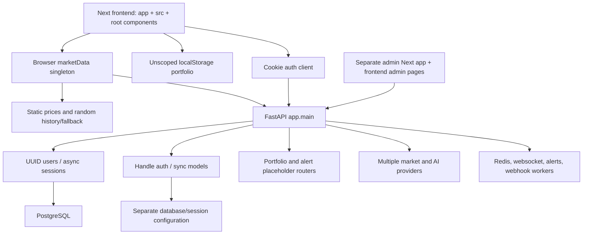

# Lokifi rebuild audit

Baseline: `e4b1a833765b33ae9d0a46d8b42ebdea3446d73b`. Original checkout preserved at `58f9471f`. Audit performed 2026-09-14; no production records or external service credentials used.

## Outcome

Lokifi is a portfolio/markets/social/AI prototype, not a release-ready financial system. Rebuild the customer portfolio journey. Retain the brand, Next.js/TypeScript/FastAPI/PostgreSQL stack and independently verified indicator algorithms as references. Retire the active social, chat, admin, AI, alert, drawing, debt and goal implementations. Do not preserve simulated financial behavior as a compatibility requirement.

The inventory contains **43 pages and 283 API declarations**. `legacy-inventory.md` enumerates every page and API declaration; JSON includes handler signatures and source locations. Declarations are not equivalent to registered endpoints. Source-inspected but unexercised behavior is marked untested rather than inferred working.

## Architecture and wiring

Registration in `apps/backend/app/main.py` selects `app.routers.portfolio` and `app.routers.alerts`, not the fuller similarly named `app.api.routes` modules. Auth uses `core.auth_deps` and UUID users, AI uses `api.deps` with handle-based users, admin users uses `core.security.get_current_user` returning dictionaries. Multiple Base/session modules and Redis clients compound the incompatibility. Startup launches background workers and mutates alert storage. Importing the backend is not a safe audit operation with inherited configuration.

## Feature decisions

| Feature | Finding | Status | Decision |
|---|---|---|---|
| Landing / onboarding | Client auth gates page; unsupported adoption/security claims | partial | rebuild |
| Account / profile | Real Argon2 + cookie code, inconsistent dependencies and insecure production cookie defaults | partial | rebuild with one session model |
| Dashboard | Browser-local assets; sample empty cards, fabricated historical metrics | simulated | rebuild |
| Portfolio | Unscoped localStorage; registered POST echoes input with id=1 | broken | rebuild with ownership and persistence |
| Markets / asset detail | Static seed catalogue, random changes/history, provider fallback simulation | simulated | replace with manual/imported valuations |
| Chart / indicators | Indicator unit fixtures pass; advanced lifecycle and fake history invalidate end-to-end claims | partial | retain algorithms only as reference; retire advanced UI |
| Watchlist / screener | Flagged stores; independent data paths; no proven persistent journey | untested | rebuild watchlist only |
| AI research page | setTimeout canned response, not backend AI integration | simulated | retire |
| Backend AI / uploads | Provider selection may silently select mock; handle auth differs from registration; file parsers broaden attack surface | partial | retire |
| Debts / goals / recap | Embedded mock debts/goals and random history | simulated | retire |
| Alerts | Registered GET returns empty array and POST echoes; separate file-backed evaluator | broken | retire |
| Social / follows / messaging | Substantial SQL/service/websocket code; not a verified coherent product journey | untested | retire |
| Notifications | Several Redis/websocket paths, schema churn; actual delivery not verified | untested | retire |
| Admin users | Anonymous fallback + disabled role check | broken | remove from active app |
| Other admin / API keys / webhooks | Parallel admin surfaces, role/model inconsistencies, externally callable worker destinations | untested | remove from active app |
| Mobile / desktop / CLI | Mobile README only; no complete applications | untested | retire placeholders |

## Prioritized findings

1. **Critical / authorization:** `core/security.py:31` returns an anonymous dictionary without credentials; `api/routes/admin_users.py:91` returns it without role enforcement. The list route does not need an authenticated identity before querying users. Static trace confirms missing enforcement; no production exploitation attempted.
2. **Critical / financial integrity:** `src/services/marketData.ts` seeds 2025 prices and generates prior closes, volumes and history, then randomizes prices on API failure. Backend forex fabricates 24h change and estimates highs/lows. Never expose these as real valuations.
3. **High / record isolation:** `src/lib/data/portfolioStorage.ts` uses a shared browser key, without account ownership. Registered backend portfolio routes do not persist. Multiple devices cannot share the authoritative record.
4. **High / session lifecycle:** cookies hardcode secure=False; several auth implementations disagree on user identity and token transport. Centralize validation, session expiry/revocation and CSRF protection.
5. **High / unsafe tests:** legacy integration fixture falls back to DATABASE_URL and drops Base tables. Audit patch requires an explicit local *_test database. New tests must validate targets before importing application code.
6. **High / install and migrations:** remote npm lock does not satisfy Vitest 4 manifest. Local audit installation repaired resolution but reported 44 advisories (3 low, 10 moderate, 29 high, 2 critical). Two migration heads are joined by an additive audit merge; fresh legacy PostgreSQL migration still fails because posts is referenced before creation. No legacy database was modified.
7. **High / configuration:** production Compose exposes database/Redis ports, frontend and Traefik compete for port 80, public API build and runtime values differ, and client code hardcodes localhost. Use one same-origin API boundary and private database networking.
8. **High / money semantics:** formatting a currency does not convert amounts. Categories inferred from section names can change financial meaning. Floats, ticker-only identifiers, missing quote omission, and random history undermine totals.
9. **Medium / false assurance:** type build errors ignored, React strict mode disabled, app routes omitted from frontend coverage, backend coverage floor 20%, mypy nonblocking, workflow lint auto-fixes source. GitHub main CI, integration, E2E and security workflows failed at the inspected revision. CodeQL passing does not repair these failures.
10. **Medium / privacy and external surfaces:** auth logs include personal identifiers; migration debugging logs database URLs. File uploads and webhook dispatch require authorization, size/type, destination and egress review before any future reintroduction. Their runtime security is unproven; removing their routes eliminates them from the new product.
11. **Medium / experience:** live synthetic dashboard has low-contrast text, redundant greetings, and sample million-euro totals in its empty state. Existing saved visual baselines include redirect/loading screens. Current captures are under test-results; no screenshot alone establishes a working financial journey.
12. **Medium / claims:** metadata advertises 50,000 users and $2B assets without evidence. Remove these and bank-level-security claims.

## Operations and domain

Cloudflare readback during planning: lokifi.com active registration through 2027-10-01, Free zone, no Worker connected. Six DNS records are MX/TXT for email, no root/www website target. No changes made. This does not prove there are no other deployment providers. No production backup or recovery evidence exists.

Docker startup on this workstation fails on its sailor-ingest socket. Rather than modifying unrelated Docker state, audit uses a separate loopback PostgreSQL cluster and unique databases. Native PostgreSQL remains PostgreSQL, not a SQLite substitute.

Provider files include CoinGecko, Finnhub, Alpha Vantage, Polygon, FMP, CoinMarketCap, news providers and multiple AI providers. Credentials, entitlements, commercial redistribution rights, costs and delivered data were not verified. All remain disabled in the replacement. ECB reference rates are informational, not execution rates: https://www.ecb.europa.eu/stats/policy_and_exchange_rates/euro_reference_exchange_rates/html/index.en.html . Public browser environment variables are fixed at Next build time: https://nextjs.org/docs/app/guides/environment-variables .

## Verification boundaries

Planning baseline: frontend/admin nonincremental TypeScript checks passed, three selected suites / 85 tests passed, 201 Python source files parsed. This audit independently inventories all declarations and runs fresh legacy migration scripts on PostgreSQL after joining heads. The migration fails before a usable backend can be established. Browser audit uses synthetic identity and explicit provider failure, with all external requests intercepted. This is sufficient to observe frontend states, not to certify the legacy backend.

Every unexercised legacy endpoint remains untested. No blanket claim of a complete penetration test, licensed data, deployed product, or customer demand is made. The audit is complete as an inventory and disposition exercise; legacy production readiness is **FAIL**. Further effort repairing retired features would not contribute to the approved product.

## Reuse and rebuild boundary

Keep the stack and brand. Use existing indicator tests as mathematical references only; no advanced chart module is needed for v1. Rebuild identity, database schema, holdings, imports, valuations, watchlists and UI with a single contract. Preserve legacy implementation in the original checkout and Git baseline. Bootstrap a fresh database; never run a schema reset against an existing database. Historical notes are archived and explicitly non-operational.
