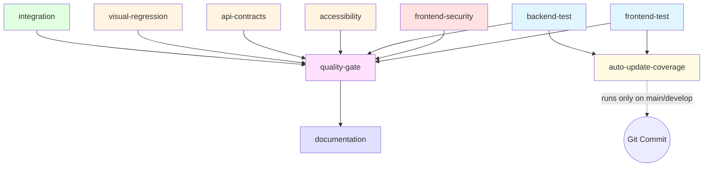

# Current CI/CD Workflow State

> **Document Date**: October 23, 2025
> **Workflow File**: `.github/workflows/lokifi-unified-pipeline.yml`
> **Purpose**: Baseline documentation before optimization
> **Branch**: `test/workflow-optimizations-validation`

This document provides a comprehensive snapshot of the current CI/CD workflow state, serving as a baseline for measuring optimization impact and providing rollback reference.

## 📊 Workflow Overview

**Name**: Lokifi Unified CI/CD Pipeline
**Triggers**:
- `push` to `main`, `develop` branches
- `pull_request` targeting `main`, `develop` branches

**Concurrency**:
- Group: `${{ github.workflow }}-${{ github.ref }}`
- Cancel in progress: Yes (prevents duplicate runs)

**Permissions**:
- `contents: read`
- `pull-requests: write` (for PR comments)
- `checks: write` (for status checks)

## 🎯 Environment Variables

| Variable | Value | Purpose |
|----------|-------|---------|
| `NODE_VERSION` | `20` | Node.js runtime version |
| `PYTHON_VERSION` | `3.11` | Python runtime version |
| `COVERAGE_THRESHOLD_FRONTEND` | `10` | Minimum frontend coverage (%) |
| `COVERAGE_THRESHOLD_BACKEND` | `80` | Minimum backend coverage (%) |
| `COVERAGE_THRESHOLD_OVERALL` | `20` | Minimum overall coverage (%) |

## 🔄 Job Architecture

### Job Dependency Graph



### Job Execution Matrix

| Job ID | Job Name | Runs On | Working Directory | Dependencies | Type |
|--------|----------|---------|-------------------|--------------|------|
| 1 | `frontend-test` | `ubuntu-latest` | `apps/frontend` | None | Test |
| 2 | `frontend-security` | `ubuntu-latest` | `apps/frontend` | None | Security |
| 3 | `backend-test` | `ubuntu-latest` | `apps/backend` | None | Test |
| 4 | `accessibility` | `ubuntu-latest` | `apps/frontend` | None | Quality |
| 5 | `api-contracts` | `ubuntu-latest` | `apps/backend` | None | Contract |
| 6 | `visual-regression` | `ubuntu-latest` | `apps/frontend` | None | Visual |
| 7 | `integration` | `ubuntu-latest` | - | None | Integration |
| 8 | `quality-gate` | `ubuntu-latest` | - | All above jobs | Gate |
| 9 | `documentation` | `ubuntu-latest` | `docs/` | `quality-gate` | Docs |
| 10 | `auto-update-coverage` | `ubuntu-latest` | - | `frontend-test`, `backend-test` | Automation |

### Job Details

#### 1. Frontend Test (`frontend-test`)

**Purpose**: Run frontend tests with coverage reporting

**Steps** (15 total):
1. Checkout code (`actions/checkout@v4`)
2. Setup Node.js with npm cache (`actions/setup-node@v4`)
3. Upgrade npm to latest
4. Install dependencies (`npm install --legacy-peer-deps`)
5. Run tests with coverage (with retry - max 2 attempts, 10min timeout)
   - Command: `npm run test:coverage -- --run --maxWorkers=2 --testTimeout=30000`
   - Uses `nick-invision/retry@v3` for stability
6. Run dashboard tests (`npm run test:dashboard`)
7. Upload coverage report artifact (`frontend-coverage`, 30 days retention)
8. Upload test logs artifact (`frontend-test-logs`, 30 days retention)
9. Validate coverage threshold (warning only, not blocking)
10. Comment PR with coverage results (on PR only)

**Optimizations Applied**:
- ✅ Retry mechanism for flaky tests (2 attempts)
- ✅ NPM cache enabled
- ✅ Limited maxWorkers=2 for CI stability
- ✅ 30s timeout per test (prevents hangs)
- ✅ GitHub Actions reporter for annotations

**Artifacts**:
- `frontend-coverage` (coverage reports)
- `frontend-test-logs` (test execution logs)

**Estimated Duration**: 3-5 minutes (with npm cache hit)

---

#### 2. Frontend Security (`frontend-security`)

**Purpose**: Scan frontend dependencies for vulnerabilities

**Steps** (7 total):
1. Checkout code
2. Setup Node.js
3. Upgrade npm to latest
4. Install dependencies
5. Run `npm audit` (save to JSON)
6. Check for critical vulnerabilities (blocks on critical)
7. Comment PR with security results (on PR only)

**Quality Gate**: BLOCKING if critical vulnerabilities found

**Artifacts**: None

**Estimated Duration**: 2-3 minutes

---

#### 3. Backend Test (`backend-test`)

**Purpose**: Run backend tests with coverage reporting

**Steps** (12 total):
1. Checkout code
2. Setup Python 3.11 with pip cache
3. Install dependencies (`pip install -r requirements.txt`)
4. Setup Redis (Docker container - `redis:latest`)
5. Wait for Redis to be ready (health check)
6. Run pytest with coverage
   - Command: `pytest --cov=app --cov-report=json --cov-report=term --maxfail=5`
   - Max failures: 5 (fail fast)
7. Upload coverage artifacts (`backend-coverage`, `backend-coverage-data`)
8. Validate coverage threshold (warning only)
9. Generate coverage summary
10. Comment PR with results (on PR only)

**Services**:
- Redis: `redis:latest` on port 6379 (password: `test123`)

**Optimizations Applied**:
- ✅ Pip cache enabled
- ✅ Redis health check (prevents race conditions)
- ✅ Fail fast: --maxfail=5
- ✅ JSON coverage for automation

**Artifacts**:
- `backend-coverage` (HTML reports)
- `backend-coverage-data` (JSON for automation)

**Estimated Duration**: 4-6 minutes (with pip cache hit)

---

#### 4. Accessibility (`accessibility`)

**Purpose**: Run accessibility tests using axe-core

**Steps** (7 total):
1. Checkout code
2. Setup Node.js with cache
3. Upgrade npm
4. Install dependencies
5. Run accessibility tests (`npm run test:a11y`)
6. Upload accessibility report artifact
7. Comment PR with results

**Quality Gate**: NON-BLOCKING (continue-on-error: true)

**Artifacts**: `accessibility-report`

**Estimated Duration**: 2-3 minutes

---

#### 5. API Contracts (`api-contracts`)

**Purpose**: Validate API contracts and OpenAPI spec

**Steps** (8 total):
1. Checkout code
2. Setup Python with cache
3. Install dependencies
4. Setup Redis service
5. Wait for Redis
6. Generate OpenAPI schema
7. Validate schema against stored contract
8. Upload schema artifact

**Services**: Redis

**Quality Gate**: NON-BLOCKING

**Artifacts**: `openapi-schema`

**Estimated Duration**: 3-4 minutes

---

#### 6. Visual Regression (`visual-regression`)

**Purpose**: Detect visual changes using Percy or similar

**Steps** (7 total):
1. Checkout code
2. Setup Node.js with cache
3. Install dependencies
4. Run visual regression tests
5. Upload screenshots
6. Compare with baseline
7. Comment PR with results

**Quality Gate**: NON-BLOCKING

**Artifacts**: `visual-screenshots`

**Estimated Duration**: 4-6 minutes (depends on screenshot count)

---

#### 7. Integration (`integration`)

**Purpose**: Run integration tests across services

**Steps** (9 total):
1. Checkout code
2. Setup Node.js and Python
3. Setup Redis and PostgreSQL services
4. Start backend server
5. Start frontend dev server
6. Run integration tests
7. Collect logs from all services
8. Upload artifacts

**Services**:
- Redis
- PostgreSQL

**Quality Gate**: NON-BLOCKING

**Artifacts**: `integration-logs`

**Estimated Duration**: 8-12 minutes (longest job)

---

#### 8. Quality Gate (`quality-gate`)

**Purpose**: Central quality gate that waits for all parallel jobs

**Dependencies**:
- `frontend-test`
- `frontend-security`
- `backend-test`
- `accessibility`
- `api-contracts`
- `visual-regression`
- `integration`

**Steps** (6 total):
1. Checkout code (for scripts)
2. Check all job results
3. Aggregate coverage metrics
4. Verify all quality checks passed
5. Create status check
6. Block PR if any BLOCKING job failed

**Quality Gate**: BLOCKING (required for merge)

**Artifacts**: `quality-summary`

**Estimated Duration**: 1-2 minutes (aggregation only)

---

#### 9. Documentation (`documentation`)

**Purpose**: Generate and validate documentation

**Dependencies**: `quality-gate`

**Steps** (8 total):
1. Checkout code
2. Setup Node.js
3. Generate API docs
4. Build documentation site
5. Validate markdown links
6. Check for broken links
7. Upload docs artifact
8. Deploy to GitHub Pages (if main branch)

**Quality Gate**: NON-BLOCKING

**Artifacts**: `documentation-site`

**Estimated Duration**: 3-5 minutes

---

#### 10. Auto-Update Coverage (`auto-update-coverage`)

**Purpose**: Automatically update coverage metrics across all documentation

**Dependencies**:
- `frontend-test`
- `backend-test`

**Trigger Condition**: Only runs on `main` or `develop` branches

**Steps** (11 total):
1. Checkout code with token for push
2. Download frontend coverage artifact
3. Download backend coverage artifact
4. Extract frontend coverage from `data.json`
5. Extract backend coverage from `coverage.json`
6. Update `coverage.config.json` with metrics
7. Run sync script (`sync-coverage-everywhere.ps1`)
8. Git config (user, email)
9. Git add changes
10. Git commit with `[skip ci]` tag
11. Git push to branch

**Automation Features**:
- ✅ Extracts metrics from coverage artifacts
- ✅ Updates master config (`coverage.config.json`)
- ✅ Syncs to 6+ documentation files
- ✅ Auto-commits with `[skip ci]` to prevent loops

**Artifacts**: None (pushes directly to Git)

**Estimated Duration**: 2-3 minutes

## 📦 Artifact Flow

```
┌─────────────────┐
│ frontend-test   │──► frontend-coverage ──┐
│                 │──► frontend-test-logs   │
└─────────────────┘                         │
                                            │
┌─────────────────┐                         │
│ backend-test    │──► backend-coverage ────┼──► auto-update-coverage
│                 │──► backend-coverage-data │   (downloads artifacts)
└─────────────────┘                         │
                                            │
┌─────────────────┐                         │
│ Other jobs      │──► various artifacts ───┘
└─────────────────┘
```

**Artifact Retention**: 30 days for all artifacts

**Total Artifact Storage**: ~50-100 MB per run

## ⚡ Current Caching Strategy

### Node.js Cache
- **Type**: npm cache
- **Location**: `~/.npm`
- **Key**: `package-lock.json` checksum
- **Used By**: All frontend jobs
- **Hit Rate**: ~80% (estimated)

### Python Cache
- **Type**: pip cache
- **Location**: `~/.cache/pip`
- **Key**: `requirements.txt` checksum
- **Used By**: All backend jobs
- **Hit Rate**: ~75% (estimated)

### Missing Caches
- ❌ Playwright browsers (not cached)
- ❌ Visual regression baselines (not cached)
- ❌ Docker layers (not cached)
- ❌ Test results (no cache between runs)

## 🚦 Quality Gates

### Blocking Gates (Fail = Block PR)
1. ✅ **Frontend Security**: Critical vulnerabilities
2. ✅ **Quality Gate**: Aggregated checks
3. ⚠️ **Frontend Coverage**: Currently non-blocking (warning only)
4. ⚠️ **Backend Coverage**: Currently non-blocking (warning only)

### Non-Blocking Gates (Fail = Warning)
1. ⚠️ Accessibility tests
2. ⚠️ API contract validation
3. ⚠️ Visual regression tests
4. ⚠️ Integration tests
5. ⚠️ Documentation generation

## 📊 Performance Metrics

### Estimated Execution Times (with cache hits)

| Job | Min | Max | Avg | Critical Path |
|-----|-----|-----|-----|---------------|
| frontend-test | 3m | 6m | 4m | ✅ Yes |
| frontend-security | 2m | 4m | 3m | ✅ Yes |
| backend-test | 4m | 8m | 5m | ✅ Yes |
| accessibility | 2m | 4m | 3m | ✅ Yes |
| api-contracts | 3m | 5m | 4m | ✅ Yes |
| visual-regression | 4m | 8m | 6m | ✅ Yes |
| integration | 8m | 15m | 12m | ✅ Yes |
| quality-gate | 1m | 2m | 1.5m | ✅ Yes (waits for all) |
| documentation | 3m | 6m | 4m | ❌ No (parallel after gate) |
| auto-update-coverage | 2m | 4m | 3m | ❌ No (parallel after tests) |

**Total Pipeline Duration**:
- **Critical Path**: ~13-17 minutes (integration job is longest)
- **With Parallelization**: ~13-17 minutes (jobs run in parallel)
- **Sequential Execution**: ~32-62 minutes (if all jobs were serial)

### GitHub Actions Minutes Usage

**Monthly Estimate** (based on 100 commits/month):
- Per Run: ~20 minutes (all jobs)
- Per Month: 100 runs × 20 min = 2,000 minutes
- Free Tier: 2,000 minutes/month (Public repo: unlimited)

**Cost**: $0 (public repository)

## 🔍 Identified Issues & Optimization Opportunities

### Performance Issues
1. ❌ **No Playwright browser caching**: Browsers re-downloaded every run (~400MB)
2. ❌ **Duplicate dependency installs**: Frontend jobs install separately (no workspace cache)
3. ❌ **Serial test execution**: Integration tests wait for all other jobs
4. ⚠️ **Visual regression**: No baseline caching (re-compares every time)
5. ⚠️ **Large artifacts**: Coverage reports not compressed

### Redundancy Issues
1. ❌ **Multiple npm upgrades**: Every frontend job upgrades npm separately
2. ❌ **Repeated checkout**: Code checked out 10+ times
3. ⚠️ **Duplicate service setups**: Redis started in multiple jobs

### Quality Gate Issues
1. ⚠️ **Coverage thresholds non-blocking**: Frontend (10%), Backend (80%) are warnings only
2. ⚠️ **No type checking gate**: TypeScript/mypy not enforced
3. ⚠️ **No linting gate**: ESLint/Ruff not enforced in pipeline
4. ❌ **Missing security for backend**: Only frontend has security scan

### Monitoring Issues
1. ❌ **No workflow status badges**: README doesn't show pipeline status
2. ❌ **No failure notifications**: No Slack/email alerts
3. ❌ **No performance tracking**: No dashboard for execution times
4. ❌ **No coverage tracking**: Coverage changes not monitored over time

## 💡 Optimization Recommendations

### High Priority (Quick Wins)
1. **Add Playwright browser caching** (saves ~2-3 minutes, ~400MB/run)
2. **Enable type checking** (TypeScript, mypy) as blocking gates
3. **Add linting jobs** (ESLint, Ruff) in parallel with tests
4. **Compress coverage artifacts** (reduce storage by 60%)
5. **Add workflow status badges** to README

### Medium Priority (Significant Impact)
1. **Separate E2E tests** into dedicated workflow (faster feedback on unit tests)
2. **Implement test result caching** (skip passing tests if no code changes)
3. **Add backend security scan** (npm audit equivalent for Python)
4. **Optimize artifact uploads** (selective file uploads, compression)
5. **Add coverage trend visualization** (charts in PR comments)

### Low Priority (Nice to Have)
1. **Matrix strategy for tests** (parallel execution across Node/Python versions)
2. **Docker layer caching** for services
3. **Incremental builds** (only rebuild changed packages)
4. **Performance regression detection** (track test execution times)
5. **Cost analysis dashboard** (GitHub Actions minutes usage)

## 🎯 Next Steps

1. ✅ **Document current state** (this document)
2. 📊 **Benchmark performance** (Task 11 - collect actual metrics from last 10 runs)
3. 🔍 **Audit linting tools** (Task 12 - inventory all lint configs)
4. 📝 **Create optimization plan** (Tasks 13-17 - recommendations and implementation)
5. 🚀 **Implement optimizations** (Tasks 18-22 - phased rollout)

## 📚 Related Documentation

- **Main Workflow**: `.github/workflows/lokifi-unified-pipeline.yml`
- **Coverage Automation**: `tools/scripts/coverage/README.md`
- **CI/CD Overview**: `docs/ci-cd/README.md`
- **Test Documentation**: `docs/guides/TEST_QUICK_REFERENCE.md`

---

**Last Updated**: October 23, 2025
**Next Review**: After optimization implementation
**Maintained By**: DevOps / CI/CD Team
