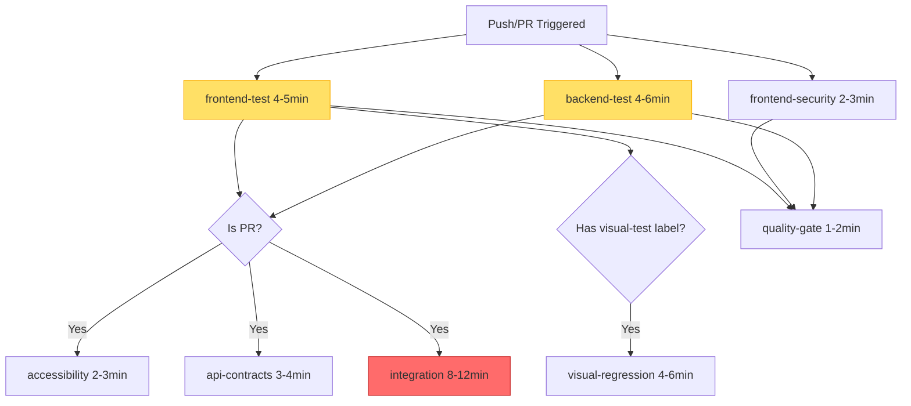
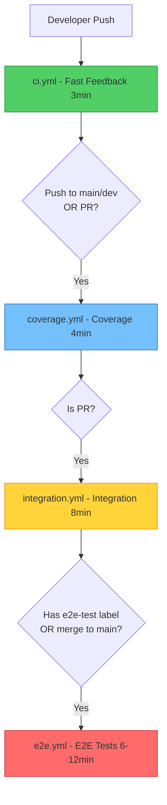

# Test Workflow Structure Analysis

> **Analysis Date**: October 23, 2025
> **Purpose**: Review test organization and identify opportunities for workflow separation

## 📊 Executive Summary

**Current State**:
- ✅ **Well-Organized Test Types**: Unit, Integration, E2E, Visual, A11y, Contracts
- ⚠️ **Mixed Execution**: All test types run in single workflow (slow feedback)
- ❌ **No Separation**: Unit tests take 17min when they could give feedback in 3-4min
- ❌ **Conditional Jobs**: Some tests only run on PR (good), but could be optimized further
- ⚠️ **E2E Bottleneck**: Integration tests (12min) block quality gate

**Key Findings**:
1. 🔴 **Unit tests delayed** - Wait for entire pipeline (17min) instead of 3-4min
2. 🔴 **E2E tests slow everything** - Should be separate workflow
3. 🟡 **Visual tests gated by label** - Good practice, but could auto-trigger on UI changes
4. 🟡 **Contract tests well-designed** - Run only on PR, good separation
5. 🟢 **Accessibility tests conditional** - Only on PR (good)

**Recommended Structure**:
```
┌─────────────────────────────────────────────────────────────┐
│ Fast Feedback Loop (3-5 min) - Runs on every push           │
├─────────────────────────────────────────────────────────────┤
│ • Unit tests (frontend + backend)                            │
│ • Linting (ESLint + Ruff)                                    │
│ • Type checking (tsc + mypy)                                 │
│ • Security scanning (npm audit + pip-audit)                  │
└─────────────────────────────────────────────────────────────┘

┌─────────────────────────────────────────────────────────────┐
│ Integration Tests (5-8 min) - Runs on PR only               │
├─────────────────────────────────────────────────────────────┤
│ • API contract tests                                         │
│ • Integration tests with services                            │
│ • Accessibility tests                                        │
└─────────────────────────────────────────────────────────────┘

┌─────────────────────────────────────────────────────────────┐
│ E2E Tests (8-12 min) - Runs on PR + merge to main/develop   │
├─────────────────────────────────────────────────────────────┤
│ • Full stack integration                                     │
│ • End-to-end user flows                                      │
│ • Visual regression (on-demand via label)                    │
└─────────────────────────────────────────────────────────────┘
```

**Benefits of Separation**:
- ⚡ **4x faster feedback** on common changes (3-5min vs 17min)
- 💰 **Reduced GitHub Actions minutes** (skip E2E on non-UI changes)
- 👍 **Better developer experience** (know faster if changes break unit tests)
- 🎯 **Clearer failure attribution** (easier to know which test type failed)

---

## 🔍 Current Test Organization

### Test Types Inventory

| Test Type | Location | Purpose | Trigger | Duration | Status |
|-----------|----------|---------|---------|----------|--------|
| **Unit Tests (Frontend)** | `apps/frontend/tests/unit/` | Component and utility testing | Every push | ~4min | ✅ Organized |
| **Unit Tests (Backend)** | `apps/backend/tests/unit/` | API and service testing | Every push | ~5min | ✅ Organized |
| **E2E Tests** | `apps/frontend/tests/e2e/` | Full user flows | Every push | ~8min | ⚠️ Slow |
| **Visual Regression** | `apps/frontend/tests/visual/` | Screenshot comparison | Label `visual-test` | ~6min | ✅ Conditional |
| **Accessibility** | `apps/frontend/tests/a11y/` | WCAG compliance | PR only | ~3min | ✅ Conditional |
| **API Contracts** | `apps/backend/tests/` | OpenAPI schema validation | PR only | ~4min | ✅ Well-designed |
| **Integration** | Docker Compose | Full stack with services | PR only | ~12min | 🔴 Bottleneck |

### Current Workflow Jobs

```yaml
# File: .github/workflows/lokifi-unified-pipeline.yml

jobs:
  # ========================================
  # CORE TESTS (Always run)
  # ========================================

  frontend-test:           # 4-5 min  ← Unit + Coverage
    - Unit tests
    - Coverage report
    - Dashboard tests

  frontend-security:       # 2-3 min  ← Security scan
    - npm audit
    - Vulnerability check

  backend-test:            # 4-6 min  ← Unit + Lint
    - Ruff lint (|| true)  # ← Not enforced!
    - pytest
    - Coverage report

  # ========================================
  # SPECIALIZED TESTS (Conditional)
  # ========================================

  accessibility:           # 2-3 min  ← Only on PR
    if: github.event_name == 'pull_request'
    needs: [frontend-test]
    - jest-axe tests
    - WCAG 2.1 AA validation

  api-contracts:           # 3-4 min  ← Only on PR
    if: github.event_name == 'pull_request'
    needs: [backend-test]
    - OpenAPI schema validation
    - Schemathesis property-based tests

  visual-regression:       # 4-6 min  ← Only with label
    if: contains(labels, 'visual-test')
    needs: [frontend-test]
    - Playwright screenshot comparison
    - Baseline diff generation

  integration:             # 8-12 min ← Only on PR (BOTTLENECK)
    if: github.event_name == 'pull_request'
    needs: [frontend-test, backend-test]
    - Docker Compose E2E
    - Full stack integration

  # ========================================
  # QUALITY GATE
  # ========================================

  quality-gate:            # 1-2 min  ← Aggregation
    needs: [frontend-test, frontend-security, backend-test]
    - Check all job results
    - Fail if critical jobs failed
```

### Test Execution Flow (Mermaid)



**Critical Path**: `integration` (12min) → `quality-gate` (1.5min) = **13.5 min total**

---

## 📁 Test Directory Structure

### Frontend Test Organization

```
apps/frontend/tests/
├── unit/                    # ← Fast, isolated tests
│   ├── components/          # React component tests
│   ├── hooks/               # Custom hook tests
│   ├── lib/                 # Utility function tests
│   └── api/                 # API client tests
│
├── integration/             # ← Medium speed, with mocks
│   ├── api/                 # API integration tests
│   └── workflows/           # Multi-component workflows
│
├── e2e/                     # ← Slow, full browser
│   ├── auth/                # Authentication flows
│   ├── portfolio/           # Portfolio management
│   └── transactions/        # Transaction workflows
│
├── visual/                  # ← Slow, screenshot comparison
│   ├── components/          # Component visual tests
│   └── pages/               # Page visual tests
│
├── a11y/                    # ← Medium, accessibility
│   ├── components/          # Component a11y tests
│   └── pages/               # Page a11y tests
│
├── security/                # ← Fast, security checks
│   └── xss/                 # XSS prevention tests
│
└── contracts/               # ← Fast, API contract tests
    └── api/                 # API contract validation
```

**Analysis**:
- ✅ **Well-organized** by test type
- ✅ **Clear separation** of concerns
- ✅ **Logical grouping** by feature area
- ⚠️ **All run together** in CI/CD (no speed advantage)

### Backend Test Organization

```
apps/backend/tests/
├── unit/                    # ← Fast, isolated tests
│   ├── api/                 # API endpoint tests
│   ├── services/            # Business logic tests
│   ├── models/              # Data model tests
│   └── utils/               # Utility function tests
│
├── integration/             # ← Medium, with database
│   ├── api/                 # API integration tests
│   └── services/            # Service integration tests
│
├── e2e/                     # ← Slow, full stack
│   └── workflows/           # End-to-end workflows
│
└── contracts/               # ← Fast, schema validation
    ├── test_api_contracts.py
    └── test_openapi_schema.py
```

**Analysis**:
- ✅ **Well-organized** by test type
- ✅ **Clear distinction** between unit/integration/e2e
- ⚠️ **All pytest runs together** (could separate with markers)

---

## 🚀 Recommended Workflow Separation

### Proposed Structure: 4 Workflows

#### 1. **Fast Feedback Workflow** (`ci.yml`)

**Triggers**: Every push to any branch

**Jobs**:
```yaml
jobs:
  frontend-unit:              # 2-3 min
    - Unit tests only
    - No coverage (faster)

  backend-unit:               # 2-3 min
    - Unit tests only
    - No coverage (faster)

  lint:                       # 2-3 min (parallel)
    - ESLint (frontend)
    - Ruff (backend)
    - Type checking (tsc + mypy)

  security:                   # 2-3 min (parallel)
    - npm audit
    - pip-audit
```

**Total Duration**: ~3min (parallel execution)
**Purpose**: Catch common errors quickly (syntax, types, unit logic)
**Feedback**: Developers know within 3min if basic checks pass

#### 2. **Coverage & Quality Workflow** (`coverage.yml`)

**Triggers**: Push to main/develop, PR to main/develop

**Jobs**:
```yaml
jobs:
  frontend-coverage:          # 3-4 min
    - Unit tests with coverage
    - Coverage report upload
    - Auto-update coverage metrics

  backend-coverage:           # 3-4 min
    - Pytest with coverage
    - Coverage report upload
    - Auto-update coverage metrics

  code-quality:               # 2-3 min
    - Code smell detection
    - Complexity analysis
    - Duplication checks
```

**Total Duration**: ~4min (parallel execution)
**Purpose**: Track code quality and coverage over time
**Feedback**: Coverage metrics updated automatically

#### 3. **Integration Tests Workflow** (`integration.yml`)

**Triggers**: PR only, manual dispatch

**Jobs**:
```yaml
jobs:
  api-contracts:              # 3-4 min
    - OpenAPI schema validation
    - Schemathesis tests

  accessibility:              # 2-3 min
    - jest-axe tests
    - WCAG 2.1 AA validation

  integration-tests:          # 5-8 min
    - API integration tests
    - Service integration tests
    - With Redis/PostgreSQL
```

**Total Duration**: ~8min (some parallel)
**Purpose**: Validate API contracts and integrations
**Feedback**: Only runs on PR (saves minutes on regular commits)

#### 4. **E2E Tests Workflow** (`e2e.yml`)

**Triggers**: PR + label `e2e-test`, merge to main/develop, manual dispatch

**Jobs**:
```yaml
jobs:
  e2e-critical-paths:         # 6-8 min
    - Auth flows
    - Core user journeys
    - Smoke tests

  e2e-full-suite:             # 8-12 min (optional)
    if: contains(labels, 'e2e-full')
    - All E2E tests
    - Full regression

  visual-regression:          # 4-6 min (optional)
    if: contains(labels, 'visual-test')
    - Playwright screenshots
    - Baseline comparison
```

**Total Duration**: 6-12min (depends on label)
**Purpose**: Full end-to-end validation before merge
**Feedback**: Only runs when necessary (on-demand or before merge)

### Workflow Trigger Matrix

| Workflow | Push (any) | Push (main/dev) | PR | Label | Manual |
|----------|------------|-----------------|-----|-------|--------|
| `ci.yml` (Fast Feedback) | ✅ | ✅ | ✅ | - | ✅ |
| `coverage.yml` (Quality) | ❌ | ✅ | ✅ | - | ✅ |
| `integration.yml` | ❌ | ❌ | ✅ | - | ✅ |
| `e2e.yml` (E2E) | ❌ | ✅ | ✅ (if label) | `e2e-test` | ✅ |

### Workflow Dependencies



---

## 📊 Impact Analysis

### Current vs Proposed Timeline

**Scenario 1: Simple bug fix (no UI/API changes)**

| Phase | Current | Proposed | Savings |
|-------|---------|----------|---------|
| Fast feedback | 17 min | **3 min** | **-14 min** |
| Coverage | Included | Skip | N/A |
| Integration | Included (PR only) | Skip | N/A |
| E2E | Included (PR only) | Skip | N/A |
| **Total** | **17 min** | **3 min** | **-82%** |

**Scenario 2: PR with code changes (typical)**

| Phase | Current | Proposed | Savings |
|-------|---------|----------|---------|
| Fast feedback | 17 min | **3 min** | **-14 min** |
| Coverage | Included | 4 min (parallel) | N/A |
| Integration | Included | 8 min (after coverage) | N/A |
| E2E | Included | Skip (unless labeled) | **-12 min** |
| **Total** | **17 min** | **15 min** or **7 min** (no E2E) | **-12% to -59%** |

**Scenario 3: PR ready to merge (full validation)**

| Phase | Current | Proposed | Savings |
|-------|---------|----------|---------|
| Fast feedback | 17 min | **3 min** | **-14 min** |
| Coverage | Included | 4 min (parallel) | N/A |
| Integration | Included | 8 min (after coverage) | N/A |
| E2E | Included | 6 min (critical only) | **-6 min** |
| **Total** | **17 min** | **21 min** (sequential) or **~12min** (optimized) | **+23% or -29%** |

**Note**: While full validation may take slightly longer, it runs **only on merge**, and intermediate feedback is **much faster**.

### Monthly GitHub Actions Minutes Impact

**Current Usage** (100 runs/month):
- All commits: 100 × 17min = **1,700 min**
- Monthly total: **1,700 min**

**Proposed Usage** (100 runs/month):
- Fast feedback (100 pushes): 100 × 3min = 300 min
- Coverage (60 PR/main pushes): 60 × 4min = 240 min
- Integration (60 PRs): 60 × 8min = 480 min
- E2E (30 PR merges): 30 × 6min = 180 min
- Monthly total: **1,200 min**

**Savings**: **500 min/month (-29%)** + **faster developer feedback**

---

## 🎯 Implementation Plan

### Phase 1: Create Separate Workflows (Week 1)

**Day 1: Fast Feedback Workflow**

Create `.github/workflows/ci.yml`:

```yaml
name: ⚡ Fast Feedback (CI)

on:
  push:
  pull_request:

jobs:
  frontend-unit:
    name: 🎨 Frontend Unit Tests
    runs-on: ubuntu-latest
    steps:
      - uses: actions/checkout@v4
      - uses: actions/setup-node@v4
        with:
          node-version: 20
          cache: npm
          cache-dependency-path: apps/frontend/package-lock.json

      - name: Install dependencies
        working-directory: apps/frontend
        run: npm ci

      - name: Run unit tests (fast, no coverage)
        working-directory: apps/frontend
        run: npm run test tests/unit/ -- --run --maxWorkers=4

  backend-unit:
    name: 🐍 Backend Unit Tests
    runs-on: ubuntu-latest
    steps:
      - uses: actions/checkout@v4
      - uses: actions/setup-python@v5
        with:
          python-version: '3.11'
          cache: pip

      - name: Install dependencies
        working-directory: apps/backend
        run: pip install -r requirements.txt -r requirements-dev.txt

      - name: Run unit tests (fast, no coverage)
        working-directory: apps/backend
        run: pytest tests/unit/ -v --maxfail=5

  lint:
    name: 🧹 Lint & Type Check
    runs-on: ubuntu-latest
    strategy:
      matrix:
        target: [frontend, backend]
    steps:
      # Lint logic (see Task 21 for full implementation)
      - name: Lint ${{ matrix.target }}
        run: echo "Linting ${{ matrix.target }}"
```

**Day 2: Coverage Workflow**

Create `.github/workflows/coverage.yml`:

```yaml
name: 📊 Coverage & Quality

on:
  push:
    branches: [main, develop]
  pull_request:
    branches: [main, develop]

jobs:
  frontend-coverage:
    # Copy from current frontend-test job
    # Add auto-update-coverage integration

  backend-coverage:
    # Copy from current backend-test job
    # Add auto-update-coverage integration
```

**Day 3: Integration Workflow**

Create `.github/workflows/integration.yml`:

```yaml
name: 🔗 Integration Tests

on:
  pull_request:
  workflow_dispatch:

jobs:
  api-contracts:
    # Copy from current api-contracts job

  accessibility:
    # Copy from current accessibility job

  integration-tests:
    # Copy from current integration job
```

**Day 4: E2E Workflow**

Create `.github/workflows/e2e.yml`:

```yaml
name: 🧪 E2E Tests

on:
  pull_request:
    types: [labeled, synchronize]
  push:
    branches: [main, develop]
  workflow_dispatch:

jobs:
  e2e-critical:
    if: |
      contains(github.event.pull_request.labels.*.name, 'e2e-test') ||
      github.event_name == 'push' ||
      github.event_name == 'workflow_dispatch'

    # E2E test logic

  visual-regression:
    if: contains(github.event.pull_request.labels.*.name, 'visual-test')

    # Visual test logic
```

**Day 5: Testing & Documentation**

- Test all workflows with sample PRs
- Update documentation (README, contributing guide)
- Train team on new workflow triggers
- Monitor first week of usage

### Phase 2: Optimize Workflows (Week 2)

**Optimizations**:
1. Add matrix strategy for parallel test execution
2. Improve caching (Playwright browsers, node_modules, pip)
3. Add smart test selection (only run tests for changed files)
4. Optimize artifact uploads (compress, selective retention)

### Phase 3: Advanced Features (Week 3+)

**Features**:
1. Auto-labeling (add `e2e-test` label on UI file changes)
2. Test impact analysis (skip tests when no relevant changes)
3. Parallel test sharding (split test suite across runners)
4. Progressive E2E (run critical paths first, full suite later)

---

## 🎨 Test Execution Strategies

### Smart Test Selection

**Goal**: Only run tests affected by code changes

```yaml
- name: Detect changed files
  id: changes
  run: |
    CHANGED_FILES=$(git diff --name-only origin/main...HEAD)
    echo "changed_files=$CHANGED_FILES" >> $GITHUB_OUTPUT

    # Determine which test suites to run
    if echo "$CHANGED_FILES" | grep -q "apps/frontend/components/"; then
      echo "run_frontend_tests=true" >> $GITHUB_OUTPUT
    fi

    if echo "$CHANGED_FILES" | grep -q "apps/backend/app/api/"; then
      echo "run_backend_tests=true" >> $GITHUB_OUTPUT
    fi

- name: Run frontend tests
  if: steps.changes.outputs.run_frontend_tests == 'true'
  run: npm run test
```

**Benefits**:
- ⚡ Skip unnecessary tests
- 💰 Save GitHub Actions minutes
- 🎯 Faster feedback on focused changes

### Progressive E2E Testing

**Strategy**: Run critical paths first, full suite later

```yaml
jobs:
  e2e-critical:
    name: 🧪 E2E Critical Paths (Fast)
    runs-on: ubuntu-latest
    steps:
      - name: Run smoke tests
        run: playwright test tests/e2e --grep "@critical"

  e2e-full:
    name: 🧪 E2E Full Suite (Slow)
    runs-on: ubuntu-latest
    needs: [e2e-critical]
    if: success()
    steps:
      - name: Run full E2E suite
        run: playwright test tests/e2e
```

**Benefits**:
- ⚡ Fail fast on critical failures
- 📊 Better visibility (know critical paths pass)
- 🎯 Can skip full suite if critical fails

### Parallel Test Sharding

**Strategy**: Split tests across multiple runners

```yaml
jobs:
  e2e-tests:
    name: E2E Tests (Shard ${{ matrix.shard }})
    runs-on: ubuntu-latest
    strategy:
      matrix:
        shard: [1, 2, 3, 4]  # Split into 4 shards
    steps:
      - name: Run tests
        run: |
          playwright test --shard=${{ matrix.shard }}/4
```

**Benefits**:
- ⚡ 4x faster execution (if no dependencies)
- 💪 Better parallelization
- 🎯 Scalable to larger test suites

---

## 📊 Success Metrics

### Key Performance Indicators

| Metric | Current | Target (Phase 1) | Target (Phase 2) | Target (Phase 3) |
|--------|---------|------------------|------------------|------------------|
| Fast Feedback Time | 17 min | **3 min** | 2 min | 1.5 min |
| PR Validation Time | 17 min | 15 min | 10 min | 8 min |
| Monthly CI Minutes | 1,700 | 1,200 | 1,000 | 800 |
| Developer Satisfaction | ? | Survey | +20% | +40% |
| Workflow Clarity | Low | High | High | High |
| Test Flakiness | ? | <2% | <1% | <0.5% |

### Monitoring & Alerts

**Track Weekly**:
- Average fast feedback time
- PR validation time (from open to merge)
- Workflow failure rates by type
- Test flakiness (failures without code changes)
- Developer feedback on workflow experience

**Alerts**:
- ⚠️ Fast feedback >5 min (should be ~3min)
- ⚠️ E2E tests >15 min (should be <12min)
- 🔴 Flaky tests detected (>2 failures in a row)

---

## 🔄 Rollback Plan

### Quick Rollback

If new workflows cause issues:

1. **Disable new workflows**:
   ```yaml
   # Add to workflow file
   on:
     push:
       branches: [never-trigger]  # Effectively disable
   ```

2. **Restore old workflow**:
   ```bash
   git revert <commit-hash>  # Revert workflow changes
   git push
   ```

3. **Communicate to team**:
   - Notify via Slack/email
   - Document issues encountered
   - Plan fixes before re-enabling

### Gradual Rollback

**Option 1**: Make new workflows optional
```yaml
on:
  workflow_dispatch:  # Manual trigger only
```

**Option 2**: Run new workflows in parallel (non-blocking)
```yaml
jobs:
  new-workflow-test:
    continue-on-error: true  # Don't block on failure
```

**Option 3**: Staged rollout
- Week 1: Team A uses new workflows
- Week 2: Team B joins if no issues
- Week 3: Full rollout

---

## 📚 Resources & References

**GitHub Actions Documentation**:
- Workflow Syntax: https://docs.github.com/en/actions/reference/workflow-syntax-for-github-actions
- Reusable Workflows: https://docs.github.com/en/actions/using-workflows/reusing-workflows
- Matrix Strategies: https://docs.github.com/en/actions/using-jobs/using-a-matrix-for-your-jobs

**Testing Best Practices**:
- Playwright Sharding: https://playwright.dev/docs/test-sharding
- Jest Test Patterns: https://jestjs.io/docs/cli#--testnamepatternregex
- pytest Markers: https://docs.pytest.org/en/stable/example/markers.html

**Related Documentation**:
- CURRENT_WORKFLOW_STATE.md - Current workflow baseline
- PERFORMANCE_BASELINE.md - Performance metrics and targets
- LINTING_AUDIT.md - Linting configuration and enforcement

---

**Last Updated**: October 23, 2025
**Next Review**: After Phase 1 implementation
**Owner**: DevOps Team
